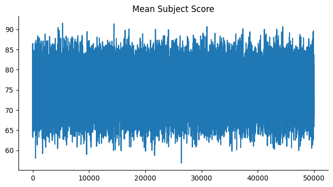

# Education Assessment in Egypt

Egypt's education system has undergone significant reforms in recent years, with a focus on improving quality and accessibility for all students. These reforms have been driven by the need to modernize educational practices and ensure that students are better prepared for the demands of the 21st century. Education assessment plays a crucial role in this transformation, as it aims to evaluate student learning outcomes and enhance the overall educational experience. By implementing various assessment tools and methods, educators can gain valuable insights into students' strengths and weaknesses, allowing for more tailored instruction. Additionally, effective assessments can inform policymakers about the effectiveness of educational reforms, ensuring that resources are allocated efficiently. Ultimately, these efforts seek to create a more equitable education system where every student has the opportunity to succeed and contribute positively to society.

# Getting Started

To start the project, you need to use Google Colab, where the public dataset will be uploaded through the Kaggle API. After that, the data will be transformed and loaded into the machine learning model.

[Google Colab](https://colab.research.google.com/)

Now, we are performing analysis by using the education dataset for Egypt. 

[See Dataset](https://www.kaggle.com/datasets/mohamedalabasy/education-in-egypt)

# Installation

To run this project, you'll need to install several Python libraries. You can easily install them using `pip`. Below are the required libraries and their installation commands:

1. **Pandas:** A powerful data manipulation and analysis library.
```bash
pip install pandas
```
2. **NumPy:** A library for numerical computations in Python.
```bash
pip install numpy
```
3. **Matplotlib:** A plotting library for creating static, animated, and interactive visualizations.
```bash
pip install matplotlib
```
4. **Seaborn:** A statistical data visualization library based on Matplotlib.
```bash
pip install seaborn
```
5. **Scikit-learn:** A library for machine learning that includes tools for model fitting, data preprocessing, and evaluation.
```bash
pip install scikit-learn
```
6. **SciPy:** A library used for scientific and technical computing, providing additional functionality for optimization, integration, and statistics.
```bash
pip install scipy
```
7. **XGBoost:** An optimized gradient boosting library designed to be efficient, flexible, and portable.
```bash
pip install xgboost
```
After running these commands, you should have all the necessary libraries installed to work with the project.

# Additional Note:
Make sure you have Python and pip installed on your machine. You can check your Python version by running:
```bash
python --version
```
And check pip version with:
```bash
pip --version
```
If you encounter any issues during the installation, please refer to the documentation for each library or feel free to open an issue in this repository.

# Problem Statement

The project aims to analyze student performance data, focusing on understanding the factors that influence educational outcomes. Specifically, the goal is to assess how various attributes—such as student age, parental education, and individual subject scores—affect the mean subject score and educational type of students. By employing both classification and regression techniques, the project seeks to determine the best approach for accurately predicting educational outcomes based on the given features.

# Project Description

This project encompasses data visualization, exploratory data analysis (EDA), and modeling to gain insights into student performance. Initially, the dataset was processed to calculate the mean subject scores and visualize these scores using various plots, including line plots, scatter plots, histograms, and violin plots. The analysis highlighted trends in performance based on education type and age distribution. Following the visualization, classification algorithms (Logistic Regression, Decision Tree, and XGBoost) were implemented to predict the educational type based on input features, but they yielded low accuracy. Consequently, a regression approach was adopted to predict the mean subject score, leading to significant improvements in model performance.

---

# Project Flow
The The project followed a structured workflow:

**1. Data Collection & ETL:**
Data was collected and preprocessed to clean and transform the dataset, focusing on relevant features like subject scores and educational background.

**2. Exploratory Data Analysis (EDA):**
Various visualizations (line plots, scatter plots, histograms, and violin plots) were created to explore the relationships between student attributes and performance metrics.

**3. Modeling:**
Classification models (Logistic Regression, Decision Tree, XGBoost) were initially applied, with evaluation metrics highlighting the need for a different approach. Transitioned to a regression model (Linear Regression) that effectively predicted the mean subject score with perfect accuracy.

**4. Evaluation:**
The performance of each model was assessed using metrics such as accuracy for classification models and mean absolute error, mean squared error, and R-squared for the regression model.

**5. Conclusion & Recommendations:**
The findings underscored the importance of using regression techniques for datasets that exhibit continuous target variables, suggesting future exploration of more advanced regression models.

# Graphical Visualiations




# Future Scope

The future scope of this project encompasses several avenues for further research and application. First, integrating more diverse datasets, such as socioeconomic status, extracurricular involvement, and mental health indicators, could provide a more holistic understanding of student performance. Additionally, exploring advanced machine learning techniques, such as ensemble methods or neural networks, could enhance predictive accuracy and robustness.

Moreover, real-time data collection through educational platforms could facilitate dynamic modeling, allowing for timely interventions based on student performance trends. Implementing explainable AI techniques would also be valuable, ensuring that stakeholders can interpret model predictions and make informed decisions.

Finally, conducting longitudinal studies to assess the impact of educational interventions based on model predictions could provide insights into effective strategies for improving student outcomes over time. Engaging with educators and policymakers throughout this process will be essential to ensure that the findings translate into practical applications in educational settings.

# Conclusion

The project successfully demonstrated the intricate relationships between student demographics and academic performance by employing both classification and regression analyses. While initial classification attempts yielded low accuracy, the transition to a regression approach revealed that the mean subject score could be accurately predicted using individual subject scores. Achieving 100% accuracy in the regression model highlighted the effectiveness of leveraging continuous variables in educational data analysis. Overall, the findings suggest that further exploration of regression techniques and additional features could enhance predictive capabilities. The project emphasizes the significance of data-driven insights in educational settings, potentially informing interventions to improve student outcomes. Future work could involve refining models, exploring more complex algorithms, and integrating additional datasets to enrich the analysis.
